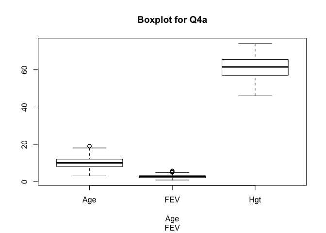
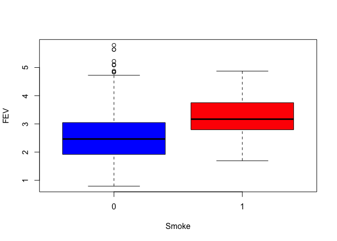

Biostat Method Rec 1
================
HS
9/10/2019

``` r
library(tidyverse)
```

    ## ── Attaching packages ──────────────────────────────────────────────────────────────────────── tidyverse 1.2.1 ──

    ## ✔ ggplot2 3.2.1     ✔ purrr   0.3.2
    ## ✔ tibble  2.1.3     ✔ dplyr   0.8.3
    ## ✔ tidyr   0.8.3     ✔ stringr 1.4.0
    ## ✔ readr   1.3.1     ✔ forcats 0.4.0

    ## ── Conflicts ─────────────────────────────────────────────────────────────────────────── tidyverse_conflicts() ──
    ## ✖ dplyr::filter() masks stats::filter()
    ## ✖ dplyr::lag()    masks stats::lag()

``` r
library(arsenal)
library(dplyr)
library(goeveg)
```

    ## Welcome to the GoeVeg Package

``` r
library(readxl)
#Define get mode function 
getmode <- function(v) {
   uniqv <- unique(v)
   uniqv[which.max(tabulate(match(v, uniqv)))]
}

# Create the vector with numbers.
#v <- c(2,1,2,3,1,2,3,4,1,5,5,3,2,3)

# Calculate the mode using the user function.
#result <- getmode(v)
#print(result)

# Create the vector with characters.
#charv <- c("o","it","the","it","it")

# Calculate the mode using the user function.
#result <- getmode(charv)
#print(result)
```

## Problem 1

## Problem 2

Twenty-five randomly selected appendectomies lasted for the following
lengths of time. Construct a histogram from the following data: 113 118
138 139 157 157 121 123 126 128 130 135 136 137 140 140 142 142 142 142
143 155 158 159 164

``` r
timelength_appendectomies = c(113,118,
138, 139, 157, 157,121, 123, 126, 128, 130, 135, 136, 137, 140, 140, 142, 142, 142, 142, 143, 155, 158, 159, 164)

#Use break to set cat width
hist(timelength_appendectomies , 
     main = "Problem 2 Histogram",
     breaks = 5,
     xlab = "time length appendectomies",
     ylab = "Abundance", 
     col = "blue")
```

<!-- -->

## Problem 3

Heart rates for ten asthmatic patients in a state of respiratory arrest
are given below. Find the mean, median, and mode.

165 145 115 110 150 145 38 140 122 155

1.  What are the mean, median, and mode?

<!-- end list -->

    ## [1] "numeric"

The mean is 128.5

The mode is 145

The median is 142.5

2.  What is the five-number summary? Make a box-plot using this data.
    The five-number summary is 38, 115, 142.5, 150, 165

<!-- end list -->

``` r
boxplot(Heart_rates_asthmatic_patients, 
        xlab = "Heart_rates_asthmatic_patients", 
        main = "boxplot for problem 3"  )
```

<!-- -->

3.  What is the Range: The range is38, 165

d.What is the variance? Standard deviation? IQR? The variance is
1325.6111111 The SD is 36.4089427 The IQR is 32

e.What is the coefficient of variation? The coefficient of is 0.2833381

## Problem 4

a.For each variable (other than ID), obtain appropriate descriptive
statistics (both numeric and graphic). \#\#First do the continiouse
variable, make a table for these \#\#Then do
the

``` r
FEV_DAT <- read_excel("/Users/haosun/Desktop/Columbia\ class/P8130\ -\ BIOSTATISTICAL\ METHODS\ I/Recitation/Rec1/FEV.DAT.xls")

print("the mean is")
```

    ## [1] "the mean is"

``` r
sapply(select(FEV_DAT,2:4), function(x) mean(as.numeric(x))) 
```

    ##       Age       FEV       Hgt 
    ##  9.931193  2.636780 61.143578

``` r
print("the mode is")
```

    ## [1] "the mode is"

``` r
sapply(select(FEV_DAT,2:4), function(x) getmode(as.numeric(x))) 
```

    ##    Age    FEV    Hgt 
    ##  9.000  3.082 63.000

``` r
print("the five number stat is")
```

    ## [1] "the five number stat is"

``` r
sapply(select(FEV_DAT,2:4), function(x) fivenum(as.numeric(x))) 
```

    ##      Age    FEV  Hgt
    ## [1,]   3 0.7910 46.0
    ## [2,]   8 1.9790 57.0
    ## [3,]  10 2.5475 61.5
    ## [4,]  12 3.1200 65.5
    ## [5,]  19 5.7930 74.0

``` r
print("the variance is")
```

    ## [1] "the variance is"

``` r
sapply(select(FEV_DAT,2:4), function(x) var(as.numeric(x))) 
```

    ##        Age        FEV        Hgt 
    ##  8.7257330  0.7517915 32.5300582

``` r
print("the sd is")
```

    ## [1] "the sd is"

``` r
sapply(select(FEV_DAT,2:4), function(x) sd(as.numeric(x))) 
```

    ##       Age       FEV       Hgt 
    ## 2.9539352 0.8670591 5.7035128

``` r
print("the iqr is")
```

    ## [1] "the iqr is"

``` r
sapply(select(FEV_DAT,2:4), function(x) IQR(as.numeric(x))) 
```

    ##    Age    FEV    Hgt 
    ## 4.0000 1.1375 8.5000

``` r
print("the coef of var is")
```

    ## [1] "the coef of var is"

``` r
sapply(select(FEV_DAT,2:4), function(x) cv(as.numeric(x))) 
```

    ##        Age        FEV        Hgt 
    ## 0.29744012 0.32883258 0.09328065

``` r
boxplot(select(FEV_DAT,2:4), 
        data=FEV_DAT, 
        xlab = colnames(select(FEV_DAT,2:6)), 
        main = "Boxplot for Q4a" )
```

<!-- -->

2.24 Use both numeric and graphic measures to assess the relationship of
FEB to age, height, and smoking status. (Do this separately for boys and
girls.)

(Use Scaltter plot to illustrate the relationship btw continious
variable)

Relationship to
Smoking

``` r
boxplot(FEV~Smoke, FEV_DAT, col=c("blue","red"))
```

<!-- -->

Relationship to age

2.25: Creat regressio line for the FEV and Age for boy and girls

b

``` r
?read_excel()
rm(list=ls())
```
